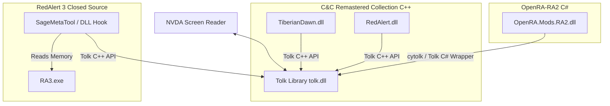

# Command & Conquer Screen Reader Accessibility Plan

This document outlines the technical analysis and implementation plan to make classic Command & Conquer (C&C) games accessible to blind and visually impaired players using the NVDA screen reader. 

Our goal is to build screen reader narration, custom keyboard navigation, and tactical status announcements for:
1. **Command & Conquer: Tiberian Dawn** (C&C 1)
2. **Command & Conquer: Red Alert 1** (RA1)
3. **Command & Conquer: Red Alert 2** (RA2)
4. **Command & Conquer: Red Alert 3** (RA3)

---

## Resolved Decisions
* **Red Alert 2 Engine:** Option A: **OpenRA-RA2** ([OpenRA-RA2](file:///C:/Users/vegas/OneDrive/Desktop/Games/OpenRA-RA2)) has been chosen. It is written in C# (open-source), has a highly moddable UI/input system, and is significantly easier to integrate screen-reader features.
* **Tiberian Dawn & Red Alert 1 Engine:** C&C Remastered Collection (C++ source DLLs in [CnCRemastered\SOURCECODE](file:///F:/SteamLibrary/steamapps/common/CnCRemastered/SOURCECODE)). While Tiberian Dawn was originally out of scope in prior planning docs, it has been integrated here per the user's latest request.
* **Real-time Feedback Approach:** **Hybrid Approach** has been selected. The game will use stereo-panned spatial sound beacons to indicate tactical map details (terrain features, unit movements, combat coordinates), and text-to-speech (TTS) speech narration will be reserved for non-spatial elements (menus, sidebar build queues, query hotkeys).
* **RA1 Diagnosability Blocker Resolved:** Implemented `AccessMod_Init()` called inside `CNC_Init` (the main DLL loading entry point) for both games. It initializes Tolk and speaks a loader verification message (`"Tiberian Dawn/Red Alert Accessibility Mod Loaded Successfully"`), resolving the lazy-load diagnostics blocker.

---

## Technical Architecture Overview

To communicate with NVDA, we will use the **Tolk** screen reader abstraction library. It auto-detects running screen readers (NVDA, JAWS, Narrator) and speaks text via a simple `Speak()` call.

---

## Proposed Changes

We will implement accessibility systems for each game based on their unique engine architectures.

### 1. Cross-Game Accessibility Design (The "Tactical Cursor")
Since RTS games lack standard UI controls, we will introduce a **Tactical Cursor Grid** system in the game loop of each game:
* **Grid Navigation:** Arrow keys (or Numpad) move a logical cursor across the map grid.
* **Coordinate Narration:** Moving the cursor speaks coordinates and content (e.g., "Ore, Allied Harvester, 50% health", "Fog of war").
* **Audio Beacons:** Pressing a key plays a repetitive spatial sound at the cursor's location, allowing players to orient themselves.
* **Selection & Actions:** Pressing `Space` selects the unit/structure at the cursor. Pressing `Enter` commands the selected units to target the cursor's location (Move, Attack, Harvest, or Repair).
* **Sidebar Narration:** Hotkeys cycle through build queues (Structures, Infantry, Vehicles, Support) and speak queue progress (e.g., "Light Tank: 50% complete", "Ready to deploy").

---

### 2. C&C Tiberian Dawn & Red Alert 1 (C&C Remastered Collection)

We will modify the official C++ source code available in your Steam folder:
`F:\SteamLibrary\steamapps\common\CnCRemastered\SOURCECODE`

#### [MODIFY] [TIBERIANDAWN DLL](file:///F:/SteamLibrary/steamapps/common/CnCRemastered/SOURCECODE/TIBERIANDAWN) & [REDALERT DLL](file:///F:/SteamLibrary/steamapps/common/CnCRemastered/SOURCECODE/REDALERT)
* **Tolk Integration:** Add `tolk.h` and link `tolk.lib` to the DLL build systems. Initialize Tolk on DLL load.
* **Input Hooking:** Intercept keyboard events in the `Input` loop to capture custom accessibility keys (e.g., grid navigation, query status).
* **Sidebar Monitoring:** Hook into `SidebarClass` and `QueueClass` to output speech alerts when items are clicked, started, or completed.
* **Menu Navigation:** Inject TTS speech outputs inside menu drawing and selection handling routines (`MenuClass`).
* **Compiling:** Build the solutions (`CnCRemastered.sln`) in Release configuration and copy `TiberianDawn.dll` / `RedAlert.dll` to `CnCRemastered/Bin`.

---

### 3. C&C Red Alert 2 (OpenRA-RA2)

We will modify the C# code in your local OpenRA repository:
`C:\Users\vegas\OneDrive\Desktop\Games\OpenRA-RA2`

#### [NEW] [AccessibilityManager.cs](file:///C:/Users/vegas/OneDrive/Desktop/Games/OpenRA-RA2/OpenRA.Mods.RA2/AccessibilityManager.cs)
* Create a central service that initializes Tolk (via P/Invoke or C# wrapper) and listens to engine events.

#### [MODIFY] [InputHandler.cs / Game.cs](file:///C:/Users/vegas/OneDrive/Desktop/Games/OpenRA-RA2/engine)
* Hook into OpenRA's engine viewport input logic to implement keyboard-only "Tactical Cursor" actions, moving the cursor actor, and speaking map tiles.
* Track and speak changes in selected units, resource counts (Credits/Ore), and sidebar construction progress.

---

### 4. C&C Red Alert 3 (Official Mod SDK Data-Driven Approach)

To align with the existing project documentation, Red Alert 3 accessibility will be built using the **official Red Alert 3 Mod SDK** (WorldBuilder + XML/W3D data-driven modding). This utilizes officially supported data configuration layers rather than reverse engineering.

#### [NEW] [AccessMod_RA3 Mod Files](file:///F:/SteamLibrary/steamapps/common/Command%20and%20Conquer%20Red%20Alert%203)
* **XML Data Definitions:** Configure SAGE engine XML files to bind custom audio triggers, cues, and keys.
* **WorldBuilder Scripting:** Script map/scenario triggers to announce key milestones and status transitions.

---

## Verification Plan

### Automated Tests
* We will verify compiled DLLs and C# binaries by checking if they load without crashing the game engine.
* Logging system: We will output debug statements to console and log files (`accessibility_debug.txt`) for key triggers (menu changes, key presses, screen reader detection).

### Manual Verification
1. **Screen Reader Detection:** Launch the game with NVDA active and verify the game speaks "Accessibility System Initialized".
2. **Menu Check:** Navigate the main menu using `Up` and `Down` arrow keys to confirm menu items are narrated.
3. **Status Check:** In-game, press `Ctrl + Shift + R` and verify NVDA speaks current credits and power status.
4. **Tactical Cursor:** Confirm arrow keys move the tactical cursor on the map and narrate what is underneath.
