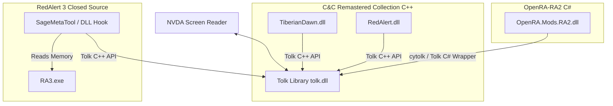

# Command & Conquer Screen Reader Accessibility Plan

This document outlines the technical analysis and implementation plan to make classic Command & Conquer (C&C) games accessible to blind and visually impaired players using the NVDA screen reader. 

Our goal is to build screen reader narration, custom keyboard navigation, and tactical status announcements for:
1. **Command & Conquer: Tiberian Dawn** (C&C 1)
2. **Command & Conquer: Red Alert 1** (RA1)
3. **Command & Conquer: Red Alert 2** (RA2)
4. **Command & Conquer: Red Alert 3** (RA3)

---

## User Review Required

> [!IMPORTANT]
> **Choose the Preferred Engine for Red Alert 2**
> * **Option A (Recommended): OpenRA-RA2 (`C:\Users\vegas\OneDrive\Desktop\Games\OpenRA-RA2`)**
>   Written in C# (open-source), it has highly moddable UI, inputs, and game states. This is significantly easier to develop, maintain, and integrate screen-reader features.
> * **Option B: Original Engine (`gamemd.exe`) via Phobos/Ares DLL Injections**
>   Maintains authentic physics and original game files but requires low-level C++ memory patching and reverse-engineering of closed-source executables.
>
> **Which engine do you prefer focusing on for Red Alert 2?**

> [!NOTE]
> **Tiberian Dawn and Red Alert 1 Engine Selection**
> For Tiberian Dawn and RA1, you have the **C&C Remastered Collection** installed. We have access to the official C++ source code in `CnCRemastered\SOURCECODE`. We propose implementing accessibility directly in these C++ DLLs (`TiberianDawn.dll` / `RedAlert.dll`). Alternatively, we could use **OpenRA**'s default Tiberian Dawn and Red Alert mods. We recommend the Remastered Collection C++ DLL approach since it uses the official modern Steam release.

---

## Open Questions

> [!WARNING]
> **Sound Cues vs. Speech Feedback**
> RTS games require rapid real-time awareness. Text-to-speech (TTS) might lag during heavy action. Do you prefer a hybrid approach where **spatial sound beacons** (such as stereo-panned sound effects) indicate map details and **speech narration** is reserved for menus, sidebar updates, and query hotkeys?

---

## Technical Architecture Overview

To communicate with NVDA, we will use the **Tolk** screen reader abstraction library. It auto-detects running screen readers (NVDA, JAWS, Narrator) and speaks text via a simple `Speak()` call.

---

## Proposed Changes

We will implement accessibility systems for each game based on their unique engine architectures.

### 1. Cross-Game Accessibility Design (The "Tactical Cursor")
Since RTS games lack standard UI controls, we will introduce a **Tactical Cursor Grid** system in the game loop of each game:
* **Grid Navigation:** Arrow keys (or Numpad) move a logical cursor across the map grid.
* **Coordinate Narration:** Moving the cursor speaks coordinates and content (e.g., "Ore, Allied Harvester, 50% health", "Fog of war").
* **Audio Beacons:** Pressing a key plays a repetitive spatial sound at the cursor's location, allowing players to orient themselves.
* **Selection & Actions:** Pressing `Space` selects the unit/structure at the cursor. Pressing `Enter` commands the selected units to target the cursor's location (Move, Attack, Harvest, or Repair).
* **Sidebar Narration:** Hotkeys cycle through build queues (Structures, Infantry, Vehicles, Support) and speak queue progress (e.g., "Light Tank: 50% complete", "Ready to deploy").

---

### 2. C&C Tiberian Dawn & Red Alert 1 (C&C Remastered Collection)

We will modify the official C++ source code available in your Steam folder:
`F:\SteamLibrary\steamapps\common\CnCRemastered\SOURCECODE`

#### [MODIFY] [TIBERIANDAWN DLL](file:///F:/SteamLibrary/steamapps/common/CnCRemastered/SOURCECODE/TIBERIANDAWN) & [REDALERT DLL](file:///F:/SteamLibrary/steamapps/common/CnCRemastered/SOURCECODE/REDALERT)
* **Tolk Integration:** Add `tolk.h` and link `tolk.lib` to the DLL build systems. Initialize Tolk on DLL load.
* **Input Hooking:** Intercept keyboard events in the `Input` loop to capture custom accessibility keys (e.g., grid navigation, query status).
* **Sidebar Monitoring:** Hook into `SidebarClass` and `QueueClass` to output speech alerts when items are clicked, started, or completed.
* **Menu Navigation:** Inject TTS speech outputs inside menu drawing and selection handling routines (`MenuClass`).
* **Compiling:** Build the solutions (`CnCRemastered.sln`) in Release configuration and copy `TiberianDawn.dll` / `RedAlert.dll` to `CnCRemastered/Bin`.

---

### 3. C&C Red Alert 2 (OpenRA-RA2)

We will modify the C# code in your local OpenRA repository:
`C:\Users\vegas\OneDrive\Desktop\Games\OpenRA-RA2`

#### [NEW] [AccessibilityManager.cs](file:///C:/Users/vegas/OneDrive/Desktop/Games/OpenRA-RA2/OpenRA.Mods.RA2/AccessibilityManager.cs)
* Create a central service that initializes Tolk (via P/Invoke or C# wrapper) and listens to engine events.

#### [MODIFY] [InputHandler.cs / Game.cs](file:///C:/Users/vegas/OneDrive/Desktop/Games/OpenRA-RA2/engine)
* Hook into OpenRA's engine viewport input logic to implement keyboard-only "Tactical Cursor" actions, moving the cursor actor, and speaking map tiles.
* Track and speak changes in selected units, resource counts (Credits/Ore), and sidebar construction progress.

---

### 4. C&C Red Alert 3 (External Memory Hook / SageMetaTool)

Since Red Alert 3 is closed-source, we will modify the open-source **SageMetaTool** dll-injector to read/hook the SAGE 2.0 engine in real time.

#### [MODIFY] [SageMetaTool DLL Source](file:///F:/SteamLibrary/steamapps/common/Command%20and%20Conquer%20Red%20Alert%203)
* **UI Hooking:** Inject hooks into `RA3.exe`'s drawing engine or UI state structures to read menu lists and sidebar updates.
* **Process Memory Reader:** Alternatively, build an external C#/Python assistant that polls RA3 process memory for coordinates, selected units, and base stats.
* **Key Emulation:** Read global keyboard state and translate accessibility hotkeys into mouse actions on the game screen using Windows `SendInput`.

---

## Verification Plan

### Automated Tests
* We will verify compiled DLLs and C# binaries by checking if they load without crashing the game engine.
* Logging system: We will output debug statements to console and log files (`accessibility_debug.txt`) for key triggers (menu changes, key presses, screen reader detection).

### Manual Verification
1. **Screen Reader Detection:** Launch the game with NVDA active and verify the game speaks "Accessibility System Initialized".
2. **Menu Check:** Navigate the main menu using `Up` and `Down` arrow keys to confirm menu items are narrated.
3. **Status Check:** In-game, press `Ctrl + Shift + R` and verify NVDA speaks current credits and power status.
4. **Tactical Cursor:** Confirm arrow keys move the tactical cursor on the map and narrate what is underneath.
